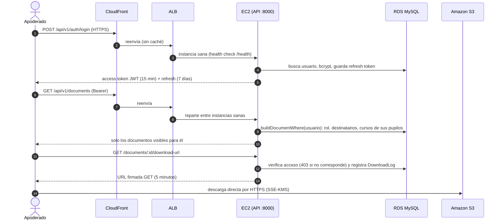

# Arquitectura de la solución

**Gestor Documental — Escuela Básica G-733 Chorombo Bajo (María Pinto)** · Región `us-east-1`, zonas `us-east-1a` y `us-east-1b`.

## Diagrama general

```mermaid
flowchart TB
    U(["Usuarios · web y app móvil<br/>equipo directivo · docentes · apoderados"])
    ADMIN(["Administración<br/>alertas por correo"])

    R53["Route 53<br/>A Alias del dominio o<br/>zona privada chorombo.internal"]
    CF["CloudFront<br/>HTTPS *.cloudfront.net<br/>caché de estáticos"]

    subgraph VPC["VPC 10.20.0.0/16 · us-east-1"]
        subgraph PUB["Subredes públicas (A y B)"]
            ALB["Application Load Balancer<br/>:80 · health check /health"]
            NATA["NAT Gateway A"]
            NATB["NAT Gateway B"]
        end
        subgraph PRIV["Subredes privadas (A y B) · Auto Scaling Group 2 a 4 · CPU objetivo 60%"]
            EC2A["EC2 t3.micro · us-east-1a<br/>API Node.js + app web :8000"]
            EC2B["EC2 t3.micro · us-east-1b<br/>API Node.js + app web :8000"]
        end
        subgraph ISO["Subredes aisladas (A y B) · sin ruta a internet"]
            RDSA[("RDS MySQL 8.0 primaria<br/>us-east-1a")]
            RDSB[("RDS en espera<br/>us-east-1b")]
        end
        VPCE["VPC Endpoint S3"]
    end

    S3[("Amazon S3<br/>SSE-KMS · versionado<br/>ciclo de vida · solo TLS")]
    SEC["IAM rol de mínimo privilegio<br/>SSM Parameter Store (secretos)"]
    CW["CloudWatch<br/>3 alarmas · dashboard · logs"]
    SNS["SNS"]

    U -->|HTTPS| R53 --> CF -->|HTTP| ALB
    ALB -->|":8000 solo desde alb_sg"| EC2A
    ALB -->|":8000 solo desde alb_sg"| EC2B
    EC2A -->|":3306 solo desde app_sg"| RDSA
    EC2B -->|":3306 solo desde app_sg"| RDSA
    RDSA <-.->|"réplica síncrona · failover"| RDSB
    EC2A -->|salida| NATA
    EC2B -->|salida| NATB
    EC2A & EC2B --> VPCE --> S3
    U -.->|"URL firmadas PUT/GET · 5 min"| S3
    SEC -.->|"credenciales y secretos"| EC2A & EC2B
    EC2A & EC2B & ALB & RDSA -.->|"métricas y logs"| CW
    CW -->|"ALARM / OK"| SNS --> ADMIN
```

Seguridad por capas: **solo el ALB** acepta tráfico de internet. Las EC2 aceptan el puerto 8000 únicamente desde el security group del ALB, y RDS acepta el 3306 únicamente desde el de las EC2. Cada subred privada sale a internet por el NAT de **su propia zona**, y las subredes aisladas no tienen ruta a internet.

## Flujo de una solicitud

## Componentes exigidos y dónde se definen

| Componente exigido | Cómo se cubre | Dónde se define |
|---|---|---|
| Frontend y backend/API | App Expo (build web) + API Express, ejecutados en EC2 detrás del ALB | `app/`, `backend/`, `compute.tf`, `ansible/` |
| Cómputo | Auto Scaling Group de Amazon EC2 (t3.micro, 2 a 4 instancias) | `compute.tf` |
| Almacenamiento de archivos | Amazon S3 (privado, SSE-KMS, versionado, ciclo de vida) | `database_storage.tf` |
| Base de datos | Amazon RDS MySQL Multi-AZ (db.t3.micro) | `database_storage.tf` |
| Red | VPC con subredes públicas, privadas y aisladas en 2 AZ, más un NAT por AZ | `network.tf` |
| Publicación | Amazon Route 53 + Application Load Balancer (+ CloudFront para contenido estático) | `compute.tf` |
| Identidad | IAM con rol de instancia de mínimo privilegio | `compute.tf` |
| Monitoreo | CloudWatch (alarmas y dashboard) + SNS por correo | `monitoring.tf` |

## Segregación de red y seguridad (ISO/IEC 27017 y 27018)

| Capa | Subred | Security Group | Entrada permitida | Ruta a internet |
|---|---|---|---|---|
| Publicación | Pública A/B | `alb_sg` | 80 (y 443 con `enable_https`) desde `0.0.0.0/0` | Internet Gateway |
| Aplicación | Privada A/B | `app_sg` | 8000 **solo desde `alb_sg`** | Su propio NAT Gateway |
| Datos | Aislada A/B | `db_sg` | 3306 **solo desde `app_sg`** | Ninguna |

| Control | Implementación | Norma |
|---|---|---|
| Segregación de red | Subredes públicas, privadas y aisladas; security groups encadenados; solo el ALB queda expuesto | 27017 CLD.9.5.1 y CLD.13.1.4 |
| Monitoreo | CloudWatch (3 alarmas + dashboard) y SNS por correo; logs JSON en CloudWatch Logs | 27017 CLD.12.4.5 |
| Cifrado en reposo | RDS `storage_encrypted`, S3 SSE-KMS con llave propia y rotación, discos EBS cifrados | 27018 A.10.3 |
| Cifrado en tránsito | HTTPS vía CloudFront; política del bucket que niega todo lo que no use TLS; HTTPS en el ALB opcional | 27018 A.10.3 |
| Mínimo privilegio | Rol IAM limitado al bucket del proyecto y a 2 parámetros SSM; Block Public Access total; IMDSv2 obligatorio | 27018 A.9.1 |
| Control de acceso en la aplicación | RBAC en el servidor (`permissions.ts`), URL firmadas de 5 minutos, auditoría de descargas y acciones, MFA TOTP para directivos, límite de intentos fallidos de login, bcrypt | — |
