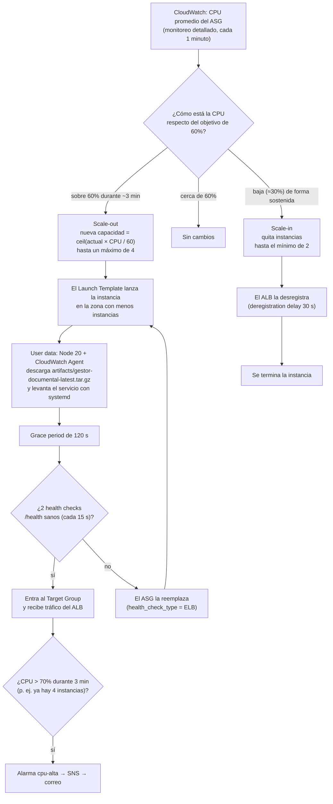

# Política de autoescalado

El Auto Scaling Group (`aws_autoscaling_group.app`) mantiene **entre 2 y 4 instancias t3.micro** repartidas entre `us-east-1a` y `us-east-1b`. La política `aws_autoscaling_policy.cpu_target_tracking` es de tipo **Target Tracking** sobre `ASGAverageCPUUtilization`, con **objetivo del 60%**.

## Diagrama de decisión



## Escenario del informe

Con **2 instancias** y una CPU promedio de **78,4%**:

```
capacidad nueva = ceil(2 × 78,4 / 60) = ceil(2,613) = 3   →   scale-out de 2 a 3 instancias
```

`python tests/validar_autoscaling.py --simular` contrasta este cálculo con los valores declarados en Terraform. Con credenciales de AWS (sin `--simular`), lee el ASG real, la política y las *Scaling Activities*.

| CPU promedio | Instancias actuales | Cálculo | Decisión |
|---|---|---|---|
| 35% | 2 | ceil(1,17) = 2 | Se mantiene en 2 (mínimo) |
| 60% | 2 | ceil(2,00) = 2 | Sin cambios |
| 78,4% | 2 | ceil(2,61) = 3 | **Scale-out 2 → 3** |
| 95% | 2 | ceil(3,17) = 4 | Scale-out 2 → 4 |
| 140% equivalente | 2 | ceil(4,67) = 5 → 4 | Tope en el máximo (4); si la CPU sigue > 70%, avisa `cpu-alta` |

## Por qué estos valores

- **Mínimo 2, una por zona**: si cae una instancia o una zona completa, la otra sigue atendiendo mientras el ASG lanza el reemplazo.
- **Máximo 4**: cubre los picos puntuales, como el día de citaciones, sin descontrolar el costo de la escuela.
- **Objetivo 60%**: deja margen para absorber el pico mientras la instancia nueva arranca (unos 2 a 3 minutos).
- **Alarma `cpu-alta` al 70%**: 10 puntos sobre el objetivo. Si se activa, el autoescalado no alcanzó a reaccionar o ya llegó al máximo.
- **Scale-in más lento que el scale-out**: la alarma de reducción que crea AWS exige un periodo sostenido bajo el objetivo, para no quitar capacidad en medio de un pico que fluctúa.

## Cómo observar el escalado durante la prueba de carga

1. Iniciar la prueba contra el ALB o CloudFront:
   ```bash
   jmeter -n -t tests/prueba_carga_cyberday.jmx -Jhost=<alb_dns_name> -Jport=80 \
     -l tests/resultados_carga_cyberday.jtl -e -o tests/informe_html/
   ```
2. Consola **EC2 → Auto Scaling Groups → chorombo-bajo-asg → Activity**: aparecen *"Launching a new EC2 instance…"* con la causa *"… changing the desired capacity from 2 to 3"*.
3. Pestaña **Monitoring** del ASG: *Desired capacity* e *In service instances* suben de 2 a 3 o 4.
4. **CloudWatch → Dashboards → chorombo-bajo-gestor-documental**: panel 1 (CPU sobre la línea de 60%) y panel 3 (saludables de 2 a 3 o 4).
5. Por línea de comandos:
   ```bash
   watch -n 15 "aws autoscaling describe-auto-scaling-groups --auto-scaling-group-names chorombo-bajo-asg \
     --query 'AutoScalingGroups[0].[DesiredCapacity,length(Instances)]' --output text"
   ```
6. Al terminar la prueba, en unos 10 a 15 minutos el ASG vuelve a 2 instancias (scale-in).
