# Guía de despliegue resumida

Tiempo aproximado: 30 a 40 minutos. RDS Multi-AZ demora entre 10 y 15 minutos en crearse.

```mermaid
flowchart LR
    A["1. aws configure"] --> B["2. TF_VAR_db_password"]
    B --> C["3. terraform init / validate"]
    C --> D["4. terraform plan / apply"]
    D --> E["5. terraform output"]
    E --> F["6. npm run build:artifact"]
    F --> G["7. generar_inventario.sh"]
    G --> H["8. ansible-playbook"]
    H --> I["9. /health 200"]
    I --> J["Pruebas y evidencias"]
    J --> K["terraform destroy"]
```



## Pasos

```bash
# 1. Credenciales (AWS Academy: copie las del panel "AWS Details", incluido aws_session_token)
aws configure
aws sts get-caller-identity

# 2. Contraseña de la base (mínimo 12 caracteres, sin / @ " ni espacios)
export TF_VAR_db_password="<clave-segura>"

# 3-5. Infraestructura
cd terraform
cp terraform.tfvars.example terraform.tfvars      # ajuste alert_email (y LabInstanceProfile en Academy)
terraform init && terraform validate
terraform plan && terraform apply
terraform output

# 6. Artefacto (desde la raíz, con Docker en ejecución)
cd ..
npm run build:artifact            # → ansible/files/gestor-documental.tar.gz

# 7. Inventario de las instancias del ASG
cd ansible
./generar_inventario.sh           # o ./generar_inventario.sh --ssm para conectarse por Systems Manager

# 8. Configuración de las instancias
ansible-playbook -i inventory.ini playbook.yml --extra-vars \
  "s3_bucket=$(terraform -chdir=../terraform output -raw s3_bucket_name) db_host=$(terraform -chdir=../terraform output -raw rds_endpoint) db_password=$TF_VAR_db_password"

# 9. Verificación
curl http://$(terraform -chdir=../terraform output -raw alb_dns_name)/health
```

> Las instancias quedan en subredes privadas. Para Ansible use una de las opciones de `inventory.ini`: **SSM** (sin SSH, con la colección `community.aws` y el plugin Session Manager) o un **bastión** con `ProxyJump`. Aunque no se ejecute Ansible, las instancias arrancan solas con `app_referencia.py` (que Terraform sube al bucket) o, después de la primera publicación del artefacto, con la aplicación completa.

## Actualizar la aplicación

```bash
npm run build:artifact
cd ansible && ansible-playbook -i inventory.ini playbook.yml --tags app,verify --extra-vars "…"
```

El playbook sube el artefacto a `s3://<bucket>/artifacts/gestor-documental-latest.tar.gz`, así que las instancias que el ASG lance después ya arrancan con la versión nueva.

## Volver al backend de referencia (contingencia)

```bash
ansible-playbook -i inventory.ini playbook.yml --tags base,referencia,verify --extra-vars "modo=referencia …"
```

## Eliminar todo (costos)

```bash
cd terraform && terraform destroy
```

El NAT Gateway por zona, RDS Multi-AZ y el ALB cobran por hora aunque no haya tráfico. El bucket tiene `force_destroy = true`: el `destroy` también borra los documentos y sus versiones.
